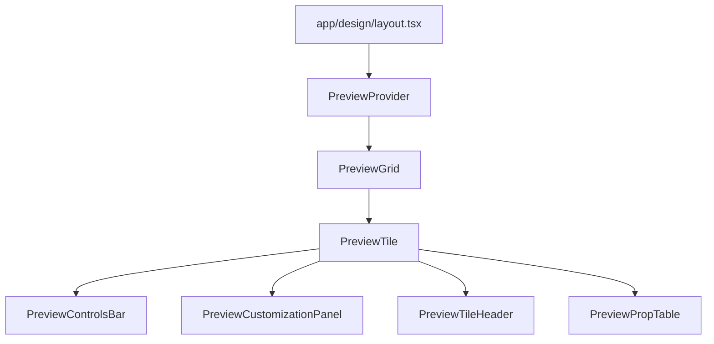

# Table of Contents
1. [Project Purpose](#project-purpose)
2. [Directory Structure](#directory-structure)
3. [Core Architecture](#core-architecture)
4. [Key Components & Files](#key-components--files)
5. [Preview System & Responsive Design](#preview-system--responsive-design)
6. [Challenging Alignment Question & Task](#challenging-alignment-question--task)

---

## Project Purpose

Magic Template is a Next.js (App Router) project for showcasing, customizing, and documenting reusable UI components and patterns. It provides live previews, code samples, and interactive controls for each component.

---

## Directory Structure

```text
app/
  layout.tsx
  page.tsx
  globals.css
  design/
    layout.tsx
    [category]/
      page.tsx
      ...
components/
  preview/
    preview-context.tsx
    preview-controls-bar.tsx
    preview-customization-panel.tsx
    preview-grid.tsx
    preview-input.tsx
    preview-prop-table.tsx
    preview-select.tsx
    preview-slider.tsx
    preview-surface.tsx
    preview-switch.tsx
    preview-tile-header.tsx
    preview-tile.tsx
  design-page-context.tsx
  simple-design-nav.tsx
  page-transition.tsx
  loading-indicator.tsx
  ui/
    button.tsx
    ...
```

---

## Core Architecture



- **app/design/layout.tsx**: Main layout for all design pages. Wraps content in `PreviewProvider` and sets up sidebar, container, and grid.
- **PreviewProvider**: Provides global preview state (customization, play/pause, expanded tile).
- **PreviewGrid**: Responsive grid for arranging preview tiles.
- **PreviewTile**: Renders a single interactive preview, code, and controls.

---

## Key Components & Files

| File/Dir                                         | Purpose/Responsibility                                                                 |
|--------------------------------------------------|----------------------------------------------------------------------------------------|
| app/design/layout.tsx                            | Main design layout, container, sidebar, grid setup                                     |
| components/preview/preview-context.tsx           | Context/provider for preview state                                                     |
| components/preview/preview-grid.tsx              | Responsive grid layout for preview tiles                                               |
| components/preview/preview-tile.tsx              | Main preview tile component                                                            |
| components/preview/preview-customization-panel.tsx| Customization controls for previews                                                    |
| components/preview/preview-controls-bar.tsx      | Play/pause, reset, theme controls                                                      |
| components/preview/preview-tile-header.tsx       | Tile header with title, description, and controls                                      |
| components/preview/preview-prop-table.tsx        | Table of component props for documentation                                             |
| components/design-page-context.tsx               | Page-level context for design metadata                                                 |
| components/simple-design-nav.tsx                 | Sidebar navigation for design categories                                               |
| app/globals.css                                 | Global styles, Tailwind base                                                           |

---

## Preview System & Responsive Design

- **Grid breakpoints and column count:**  
  - *File:* `components/preview/preview-grid.tsx`  
  - *How:* Uses CSS Grid with `repeat(auto-fit, minmax(var(--tile-min,280px),1fr))`. The `minColPx` prop (default 280) sets the minimum tile width. The grid auto-fits as many columns as will fit, so the number of tiles per row adapts to screen size.

- **Container and padding:**  
  - *File:* `app/design/layout.tsx`  
  - *How:* Sets max width, horizontal padding, and flex layout for sidebar/content using Tailwind responsive classes.

- **Sidebar visibility:**  
  - *File:* `app/design/layout.tsx`  
  - *How:* Sidebar is hidden on mobile (`hidden md:block`), visible on tablet and up.

- **Tile aspect ratio and sizing:**  
  - *File:* `components/preview/preview-tile.tsx`  
  - *How:* Responsive classes and aspect ratio utilities for tile sizing.

- **Summary:**  
  - 1 tile for mobile (full width)
  - 2 for tablet (auto-fit, min 280px)
  - 4 for widescreen (auto-fit, min 280px)

---

## Challenging Alignment Question & Task

**Question:**  
Which file is responsible for determining how many preview tiles are shown per row at different screen sizes, and how does it achieve responsive behavior?

**Task:**  
Update the project so that the preview grid shows 3 tiles per row on large screens (≥1024px) instead of 4, but keeps the current behavior for mobile and tablet. List the file(s) you would change and explain your reasoning.

---

*This document is self-contained and provides all the context needed to answer and implement the above task without scanning the project.*
```