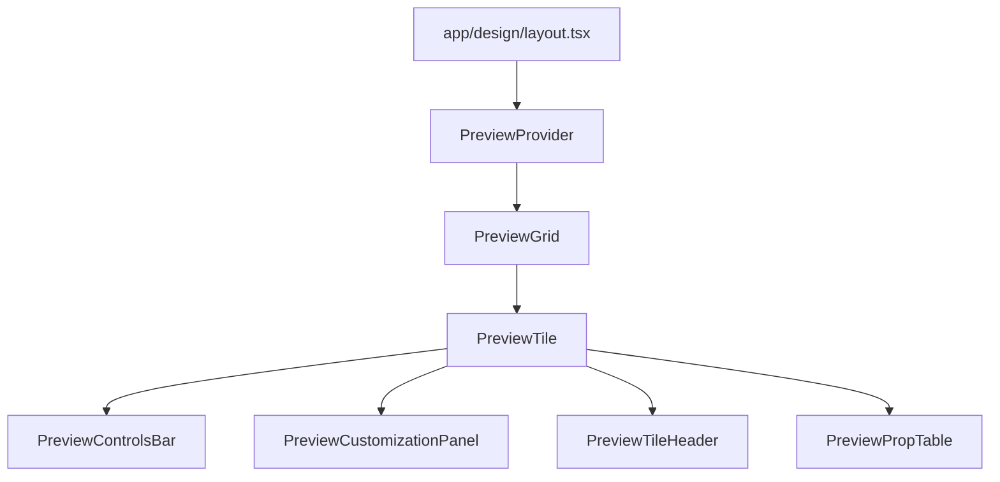

# Preview Tile Project Design

## Architecture Overview

The preview customization system is built around several interconnected components that work together to provide both global (page-level) and local (tile-level) customization. This document outlines the architecture, components, and data flow.


# Preview Tile Project Design

## Directory Structure

```text
app/
    design/
        layout.tsx - controls the design and responsive max 4 preview-tile width
        [category]/
            page.tsx - implements page level controls
            ...
components/
    preview/
        preview-context.tsx
        preview-controls-bar.tsx
        preview-customization-panel.tsx
        preview-grid.tsx
        preview-input.tsx
        preview-prop-table.tsx
        preview-select.tsx
        preview-slider.tsx
        preview-surface.tsx
        preview-switch.tsx
        preview-tile-header.tsx
        preview-tile.tsx
```

## Layout Diagram



## Preview System Files

1. `components/preview/preview-context.tsx` — Context and provider for preview state (customization, play/pause, expanded tile, etc).
2. `components/preview/preview-controls-bar.tsx` — Play/pause, reset, and theme toggle controls.
3. `components/preview/preview-customization-panel.tsx` — Dynamic panel of controls for customizing previews.
4. `components/preview/preview-grid.tsx` — Responsive grid wrapper for preview tiles.
5. `components/preview/preview-input.tsx` — Styled input for customization panels.
6. `components/preview/preview-prop-table.tsx` — Table of component props for documentation.
7. `components/preview/preview-select.tsx` — Styled select dropdown for customization panels.
8. `components/preview/preview-slider.tsx` — Styled slider for numeric customization.
9. `components/preview/preview-surface.tsx` — Deprecated. Was used for wrapping previews, now replaced by layout/provider.
10. `components/preview/preview-switch.tsx` — Styled toggle switch for boolean customization.
11. `components/preview/preview-tile-header.tsx` — Header for preview tile, with title, description, and controls.
12. `components/preview/preview-tile.tsx` — Main component for rendering a single interactive preview tile.

## Responsive Design

- **Grid breakpoints and column count:**
    - *File:* `components/preview/preview-grid.tsx`
    - *Responsibility:* Sets the responsive grid using CSS Grid with `auto-fit` and `minmax`. Controls how many tiles per row based on available width. No hardcoded breakpoints; adapts to container size.

- **Container and padding:**
    - *File:* `app/design/layout.tsx`
    - *Responsibility:* Sets the main container width, horizontal padding, and flex layout for sidebar/content. Uses Tailwind's responsive classes for spacing.

- **Sidebar visibility:**
    - *File:* `app/design/layout.tsx`
    - *Responsibility:* Sidebar (`SimpleDesignNav`) is hidden on mobile (`hidden md:block`) and visible on tablet and up.

- **Tile aspect ratio and sizing:**
    - *File:* `components/preview/preview-tile.tsx`
    - *Responsibility:* Each tile uses responsive classes and may set aspect ratio or min/max width for different breakpoints.

- **Tile content scaling:**
    - *File:* `components/preview/preview-tile.tsx`
    - *Responsibility:* Child components and controls use Tailwind responsive classes for font size, padding, and layout.

- **Summary:**
    - 1 tile for mobile (full width)
    - 2 for tablet (auto-fit, min 280px)
    - 4 for widescreen (auto-fit, min 280px)

---

## Preview System File Reference

Below is a numbered list of all files in `/components/preview` with explanations and file path references:

1. **preview-context.tsx**  
    *File:* `components/preview/preview-context.tsx`  
    *What:* Defines the React Context and Provider for all preview tile state (customization, play/pause, expanded tile, etc). Exports hooks for accessing and updating this state.  
    *Where Used:* Imported by all preview-related components (e.g., `PreviewTile`, `PreviewControlsBar`, `PreviewCustomizationPanel`) to access shared state. The `PreviewProvider` wraps all design pages via the main layout.

2. **preview-controls-bar.tsx**  
    *File:* `components/preview/preview-controls-bar.tsx`  
    *What:* Renders the play/pause, reset, and theme toggle controls for previews.  
    *Where Used:* Typically rendered at the top of a preview area or tile, often inside a `PreviewProvider`. Uses `usePreviewContext` to control state.

3. **preview-customization-panel.tsx**  
    *File:* `components/preview/preview-customization-panel.tsx`  
    *What:* Renders a dynamic panel of controls (sliders, color pickers, switches, etc) for customizing previewed components.  
    *Where Used:* Used inside `PreviewTile` or as a sidebar/panel in design pages to allow users to tweak component props live.

4. **preview-grid.tsx**  
    *File:* `components/preview/preview-grid.tsx`  
    *What:* A responsive CSS grid wrapper for laying out multiple preview tiles. Handles auto-fit and min column width.  
    *Where Used:* Used in the main design layout to wrap all preview tiles on a page, ensuring consistent grid layout.

5. **preview-input.tsx**  
    *File:* `components/preview/preview-input.tsx`  
    *What:* A styled input component for use in customization panels or controls.  
    *Where Used:* Used by `PreviewCustomizationPanel` and any custom field needing a text input, often bound to context state.

6. **preview-prop-table.tsx**  
    *File:* `components/preview/preview-prop-table.tsx`  
    *What:* Renders a table of component props, types, and descriptions for documentation purposes.  
    *Where Used:* Used in preview tiles or documentation sections to show the API of a component.

7. **preview-select.tsx**  
    *File:* `components/preview/preview-select.tsx`  
    *What:* A styled select dropdown for use in customization panels or controls.  
    *Where Used:* Used by `PreviewCustomizationPanel` or custom fields needing a dropdown, often bound to context state.

8. **preview-slider.tsx**  
    *File:* `components/preview/preview-slider.tsx`  
    *What:* A styled slider (range input) for numeric customization.  
    *Where Used:* Used by `PreviewCustomizationPanel` for numeric fields (e.g., border radius, font size).

9. **preview-surface.tsx**  
    *File:* `components/preview/preview-surface.tsx`  
    *What:* (Deprecated/removed) Used to wrap previews in a grid or plain layout, providing a `PreviewProvider`. Now replaced by the main layout and `PreviewProvider`.
    *Where Used:* Was used in older preview pages, now removed from active usage.

10. **preview-switch.tsx**  
     *File:* `components/preview/preview-switch.tsx`  
     *What:* A styled toggle switch for boolean customization.  
     *Where Used:* Used by `PreviewCustomizationPanel` for boolean fields (e.g., bold text, enable shadow).

11. **preview-tile-header.tsx**  
     *File:* `components/preview/preview-tile-header.tsx`  
     *What:* Renders the header for a preview tile, including title, description, and control buttons (customize, code, copy, close).  
     *Where Used:* Used inside `PreviewTile` to provide a consistent header and controls for each tile.

12. **preview-tile.tsx**  
     *File:* `components/preview/preview-tile.tsx`  
     *What:* The main component for rendering a single interactive preview tile, including live preview, code, and customization controls.  
     *Where Used:* Used throughout all design example pages to display each component example. Consumes context from `preview-context.tsx`.