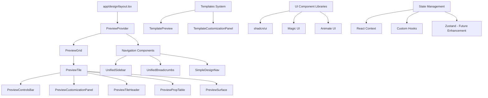

# Table of Contents
1. [Project Purpose](#project-purpose)
2. [Directory Structure](#directory-structure)
3. [Core Architecture](#core-architecture)
4. [Key Components & Files](#key-components--files)
5. [Preview System & Responsive Design](#preview-system--responsive-design)
6. [Navigation System](#navigation-system)
7. [Backend Integration](#backend-integration)
8. [Testing & Quality Assurance](#testing--quality-assurance)
9. [Challenging Alignment Question & Task](#challenging-alignment-question--task)

---

## Project Purpose

**Web Design Workshop** is a comprehensive Next.js (App Router) project for showcasing, customizing, and documenting reusable UI components and patterns. It serves as both a living component library and an interactive design collaboration tool that bridges the gap between design and development teams through live previews, code samples, and real-time customization capabilities.

Key objectives:
- Provide interactive component galleries with live customization
- Demonstrate modern web development techniques and best practices
- Serve as a portfolio piece for showcasing development skills
- Facilitate collaboration between designers and developers
- Offer reusable templates and patterns for rapid prototyping

---

## Directory Structure

```text
app/
  layout.tsx                    # Root application layout
  page.tsx                      # Landing page
  globals.css                   # Global styles and Tailwind base
  navigation.config.ts          # Navigation configuration
  design/
    layout.tsx                  # Design section layout wrapper
    page.tsx                    # Design section index
    [category]/                 # Dynamic category routes (animations, buttons, etc.)
      layout.tsx
      page.tsx
  templates/
    layout.tsx                  # Templates section layout
    page.tsx                    # Templates index
    dashboard/
      layout.tsx
      page.tsx                  # Dashboard template
  api/                          # API routes (future endpoints)
  dashboard/                    # Dashboard section
components/
  navigation/
    unified-navbar.tsx          # Main navigation bar
    unified-breadcrumbs.tsx     # Breadcrumb navigation
    unified-sidebar.tsx         # Sidebar navigation for design sections
  preview/
    preview-context.tsx         # Global preview state management
    preview-controls-bar.tsx    # Playback and control functions
    preview-customization-panel.tsx # Real-time customization controls
    preview-grid.tsx            # Responsive preview tile grid
    preview-input.tsx           # Custom input components
    preview-prop-table.tsx      # Component property documentation
    preview-select.tsx          # Custom select components
    preview-slider.tsx          # Slider controls for customization
    preview-surface.tsx         # Preview display surface
    preview-switch.tsx          # Toggle switches
    preview-tile-header.tsx     # Tile headers with metadata
    preview-tile.tsx            # Main interactive preview tile
  ui/                           # shadcn/ui component library
  magicui/                      # Custom Magic UI animations
  animate-ui/                   # Custom Animate UI components
  templates-preview/            # Template-specific preview components
    template-preview.tsx
    template-customization-panel.tsx
  design-preview/               # Design-specific preview components
    design-preview.tsx
    design-customization-panel.tsx
  design-page-context.tsx       # Page-level context for design metadata
  simple-design-nav.tsx         # Lightweight design navigation
  page-transition.tsx           # Smooth page transitions
  loading-indicator.tsx         # Loading states and indicators
  hero-landing.tsx              # Landing page hero section
  feature-cards.tsx             # Feature showcase components
  top-navbar.tsx                # Alternative navigation component
constants/
  Categories.js                 # Component categorization logic
  Components.js                 # Component registry and metadata
lib/
  utils.ts                      # Utility functions
  site.ts                       # Site configuration and metadata
hooks/
  use-design-controls.ts        # Custom hooks for design interactions
  use-mobile.ts                 # Mobile detection and responsive behavior
```

---

## Core Architecture



**Key Architectural Patterns:**
- **Multiple Component Libraries Integration:** Unified interface for shadcn/ui, Magic UI, and Animate UI
- **Template-Based Architecture:** Reusable patterns for common layouts and interactions
- **Preview System:** Real-time customization with live updates
- **Navigation Architecture:** Unified navigation system across design and template sections
- **Responsive Design:** Mobile-first approach with adaptive layouts

---

## Key Components & Files

| File/Dir                                         | Purpose/Responsibility                                                                 |
|--------------------------------------------------|----------------------------------------------------------------------------------------|
| app/design/layout.tsx                            | Main design layout, container, sidebar, grid setup                                     |
| components/preview/preview-context.tsx           | Context/provider for preview state                                                     |
| components/preview/preview-grid.tsx              | Responsive grid layout for preview tiles with auto-fit adaptation                      |
| components/preview/preview-tile.tsx              | Main preview tile component with interactive capabilities                              |
| components/preview/preview-customization-panel.tsx| Real-time customization controls with parameter adjustment                            |
| components/preview/preview-controls-bar.tsx      | Play/pause, reset, theme toggles, and animation controls                              |
| components/preview/preview-tile-header.tsx       | Tile metadata with title, description, source links                                    |
| components/preview/preview-prop-table.tsx        | Interactive component property documentation and API reference                        |
| components/navigation/unified-navbar.tsx         | Main site navigation with responsive behavior                                          |
| components/navigation/unified-sidebar.tsx        | Context-aware sidebar for design sections                                              |
| components/design-page-context.tsx               | Page-level context for category metadata, SEO, and routing                            |
| components/simple-design-nav.tsx                 | Lightweight navigation for simpler design pages                                        |
| app/globals.css                                 | Global styles, Tailwind base, theme variables                                          |
| constants/Components.js                          | Component registry mapping types, categories, and implementations                      |
| constants/Categories.js                          | Design system categorization and taxonomy                                              |

---

## Preview System & Responsive Design

**Grid System Architecture:**
- **File:** `components/preview/preview-grid.tsx`
- **Implementation:** CSS Grid with `repeat(auto-fit, minmax(var(--tile-min,280px),1fr))`
- **Breakpoint Strategy:**
  - **Mobile (< 768px):** 1 column, full-width tiles
  - **Tablet (768px - 1024px):** Auto-fit minimum 280px, typically 2 columns
  - **Desktop (≥ 1024px):** Auto-fit minimum 280px, typically 3-4 columns
  - **Large Desktop (≥ 1280px):** Auto-fit minimum 280px, typically 4-5 columns

**Responsive Breakpoints:**
- **Container System:** Max-width constraints with responsive padding
- **Sidebar Behavior:** Hidden on mobile, overlay/collapsible on tablet, persistent on desktop
- **Tile Sizing:** Aspect-ratio aware with min/max constraints
- **Controls Adaptation:** Stacked on mobile, inline on larger screens

**Design System Integration:**
- **Theme Variables:** CSS custom properties for consistent theming
- **Dark/Light Mode:** System preference detection with manual toggle
- **Component Variants:** Size, color, and interaction state variations

---

## Navigation System

**Unified Navigation Architecture:**
```
├── unified-navbar.tsx      # Main site navigation (header)
├── unified-sidebar.tsx     # Section-specific navigation (sidebar)
└── unified-breadcrumbs.tsx # Contextual navigation (breadcrumbs)
```

**Navigation Features:**
- **Responsive Adaptation:** Collapsible hamburger menu on mobile
- **Active State Tracking:** Automatic highlighting based on current route
- **Category Organization:** Hierarchical design system navigation
- **Breadcrumb Context:** Deep linking with ancestry awareness
- **Search Integration:** Future enhancement for component discovery

---

## Backend Integration

**Current State:** Client-side focused with static generation
**Future Enhancements:**
- **API Routes:** `/app/api/` structure for dynamic features
- **CMS Integration:** Content management for component library updates
- **Analytics:** Usage tracking and performance monitoring
- **Authentication:** User accounts for saved customizations
- **CDN Integration:** Optimized asset delivery

---

## Testing & Quality Assurance

**Test Infrastructure:**
- **Playwright E2E:** Cross-browser testing with `e2e/` test suites
- **Vitest Unit:** Modern testing framework for components and utilities
- **Visual Regression:** Automated UI change detection
- **Performance Testing:** Lighthouse integration and monitoring

**Quality Gates:**
- **ESLint Configuration:** Custom rules for consistency
- **TypeScript Strict Mode:** Type safety across the application
- **Pre-commit Hooks:** Automated formatting and validation
- **Build Validation:** CI/CD pipeline with comprehensive checks

---

## Challenging Alignment Question & Task

**Question:**
Which file components are responsible for the responsive behavior of the preview grid, and how do they coordinate to achieve the adaptive tile layout across different screen sizes?

**Task:**
Implement a new responsive breakpoint for extra-large displays (≥1440px) that shows exactly 4 tiles per row while maintaining the current auto-fit behavior for smaller screens. You should:

1. Analyze the current responsive implementation
2. Modify the grid system to include the new breakpoint
3. Ensure backward compatibility with existing behavior
4. Update any related CSS classes or configuration files
5. Test the changes across different viewport sizes

**Expected Changes:**
- Update `components/preview/preview-grid.tsx` for grid logic
- Possibly modify global CSS or Tailwind configuration
- Ensure mobile/tablet behavior remains unchanged

---

*This documentation reflects the current architecture as of the latest update and provides comprehensive guidance for understanding and extending the Web Design Workshop project.*
