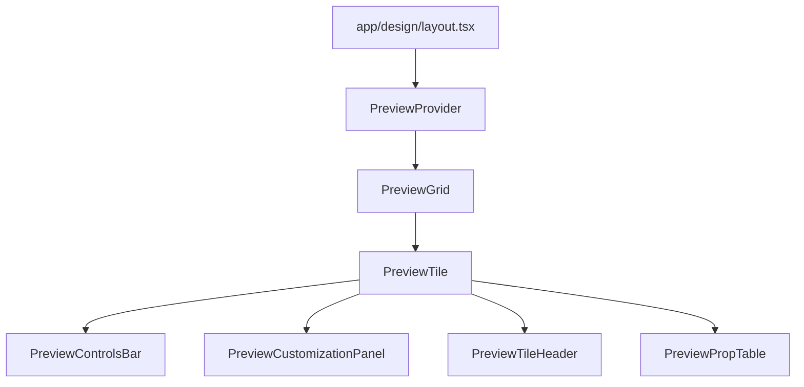

# Table of Contents
1. [Project Purpose](#project-purpose)
2. [Directory Structure](#directory-structure)
3. [Core Architecture](#core-architecture)
4. [Key Components & Files](#key-components--files)
5. [Preview System & Responsive Design](#preview-system--responsive-design)
6. [Challenging Alignment Question & Task](#challenging-alignment-question--task)

---

## Project Purpose

Magic Template is a Next.js (App Router) project for showcasing, customizing, and documenting reusable UI components and patterns. It provides live previews, code samples, and interactive controls for each component.

---

## Directory Structure

```text
app/
  layout.tsx - this handles design
  page.tsx
  globals.css
  design/
    layout.tsx - this handles design
    page.tsx - this handles design
    animations/
      layout.tsx - this handles design
      page.tsx - this handles design
      animate-ui/
      animatecss/
      magicui/
      reactbits/
    backgrounds/
      layout.tsx - this handles design
      page.tsx - this handles design
      animate-ui/
      html-css/
      magicui/
      tailwind/
    buttons/
      layout.tsx - this handles design
      page.tsx - this handles design
      animate-css/
      animate-ui/
      customize/
      html-css/
      interactive-accessibility-examples.tsx - this handles design
      magic/
      responsive-examples.tsx - this handles design
      shadcn/
      tailwind/
    effects/
      layout.tsx - this handles design
      page.tsx - this handles design
      html-css/
      magicui/
      tailwind/
    responsive-design/
      layout.tsx - this handles design
      page.tsx - this handles design
      html-css/
      magicui/
      nextjs/
      tailwind/
      tailwindcss/
    text/
      layout.tsx - this handles design
      page.tsx - this handles design
      html-css/
      magicui/
      reactbits/
      shadcn/
      tailwind/
    transitions/
      layout.tsx - this handles design
      page.tsx - this handles design
      html-css/
      magicui/
      nextjs/
      tailwind/
  templates/
    layout.tsx - this handles design
    page.tsx
    contact/
      page.tsx
    dashboard/
      page.tsx
    login/
      page.tsx
    template-plan.md
  navigation.config.ts
  templates-navigation.config.ts
  favicon.ico
  not-found.tsx
  opengraph-image.tsx
  api/
  dashboard/
  test-report/
components/
  navigation/
    unified-navbar.tsx - this handles design
    unified-breadcrumbs.tsx - this handles design
    unified-sidebar.tsx - this handles design
  preview/
    preview-context.tsx - this handles design
    preview-controls-bar.tsx - this handles design
    preview-customization-panel.tsx - this handles design
    preview-grid.tsx - this handles design
    preview-input.tsx - this handles design
    preview-prop-table.tsx - this handles design
    preview-select.tsx - this handles design
    preview-slider.tsx - this handles design
    preview-surface.tsx - this handles design
    preview-switch.tsx - this handles design
    preview-tile-header.tsx - this handles design
    preview-tile.tsx - this handles design
  design-page-context.tsx - this handles design
  simple-design-nav.tsx - this handles design
  page-transition.tsx - this handles design
  loading-indicator.tsx
  ui/ - shadcn/ui components
  magicui/ - custom Magic UI components
  animate-ui/ - custom Animate UI components
  templates/ - custom template components
  # Other component files: BlurText.tsx, ClickSpark.tsx, etc. (many design-related components)
```

---

## Core Architecture



- **app/design/layout.tsx**: Main layout for all design pages. Wraps content in `PreviewProvider` and sets up sidebar, container, and grid.
- **PreviewProvider**: Provides global preview state (customization, play/pause, expanded tile).
- **PreviewGrid**: Responsive grid for arranging preview tiles.
- **PreviewTile**: Renders a single interactive preview, code, and controls.

---

## Key Components & Files

| File/Dir                                         | Purpose/Responsibility                                                                 |
|--------------------------------------------------|----------------------------------------------------------------------------------------|
| app/design/layout.tsx                            | Main design layout, container, sidebar, grid setup                                     |
| components/preview/preview-context.tsx           | Context/provider for preview state                                                     |
| components/preview/preview-grid.tsx              | Responsive grid layout for preview tiles                                               |
| components/preview/preview-tile.tsx              | Main preview tile component                                                            |
| components/preview/preview-customization-panel.tsx| Customization controls for previews                                                    |
| components/preview/preview-controls-bar.tsx      | Play/pause, reset, theme controls                                                      |
| components/preview/preview-tile-header.tsx       | Tile header with title, description, and controls                                      |
| components/preview/preview-prop-table.tsx        | Table of component props for documentation                                             |
| components/design-page-context.tsx               | Page-level context for design metadata                                                 |
| components/simple-design-nav.tsx                 | Sidebar navigation for design categories                                               |
| app/globals.css                                 | Global styles, Tailwind base                                                           |

---

## Preview System & Responsive Design

- **Grid breakpoints and column count:**  
  - *File:* `components/preview/preview-grid.tsx`  
  - *How:* Uses CSS Grid with `repeat(auto-fit, minmax(var(--tile-min,280px),1fr))`. The `minColPx` prop (default 280) sets the minimum tile width. The grid auto-fits as many columns as will fit, so the number of tiles per row adapts to screen size.

- **Container and padding:**  
  - *File:* `app/design/layout.tsx`  
  - *How:* Sets max width, horizontal padding, and flex layout for sidebar/content using Tailwind responsive classes.

- **Sidebar visibility:**  
  - *File:* `app/design/layout.tsx`  
  - *How:* Sidebar is hidden on mobile (`hidden md:block`), visible on tablet and up.

- **Tile aspect ratio and sizing:**  
  - *File:* `components/preview/preview-tile.tsx`  
  - *How:* Responsive classes and aspect ratio utilities for tile sizing.

- **Summary:**  
  - 1 tile for mobile (full width)
  - 2 for tablet (auto-fit, min 280px)
  - 4 for widescreen (auto-fit, min 280px)

---


RULES:
1. It is not my responsibility to remind you to check the files or use Context7 before providing code
2. If you are about to provide code without having used context7 you must, pause to use context7 and review the code you are about to write or submit
3. Do not waste context with apologies or placate my feelings with congratulatary statements
4. Never assigning a task as complete without the user confirming the success of the task