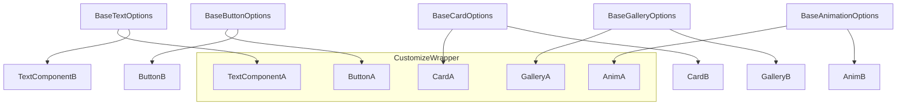
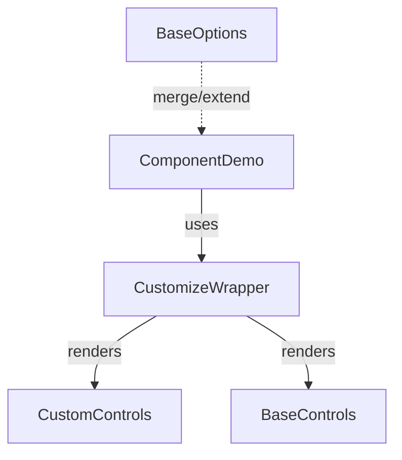

## Project Plan: Hybrid Customization System

### Current State Analysis
**GOOD**: We already have a functional `PreviewTile` component with integrated `preview-controls` system that provides:
- Individual component customization via context
- Play/pause/text controls
- Code examples with syntax highlighting
- Customization panels with sliders, switches, inputs

**NEEDS IMPROVEMENT**:
1. **Page-level controls**: Use animate-ui's `ManagementBar` for sticky global controls (play all, pause all, reset all)
2. **Component text editing**: Button text like "Press me" should be editable and affect the actual button content, not just labels
3. **Tile expansion**: Replace downward expansion with responsive row-filling expansion
4. **Base category options**: Add predefined option sets for text, button, card, gallery, and animation components
5. **Remove duplications**: Clean up unused legacy Preview components and Chakra dependencies

**KEEP**: Use existing preview-controls structure, shadcn/ui tabs and navigation, PreviewTile architecture

---

- The sample components are at /components/common/Preview .
- The demo code is at /components/reactbits-demo
- Our target code is at components/preview-controls (rename it to preview and follow lower-case-dash syntax)

### 1. Guiding Principles
- **KISS**: Keep the customization logic as simple as possible.
- **DRY**: Avoid duplication by extracting common options per component category.
- **Extensible**: Allow each component to extend or override base options as needed.
- **Accurate UX**: Ensure the UI only exposes relevant controls for each component.

---

### 2. Hybrid Customization Model

#### a. Base Options by Category

**Component Categories and Base Options**

- **Text Components**
	- text input
	- font family
	- font size
	- font weight
	- text color
	- background color
	- alignment
	- letter spacing
	- line height

- **Button Components**
	- button text
	- onClick handler
	- onHover style/handler
	- text color
	- background color
	- border radius
	- font size
	- font weight
	- icon (optional)
	- shadow

- **Card/Grid Components**
	- background color
	- border radius
	- shadow
	- padding
	- gap/spacing
	- item alignment
	- responsive columns/rows

- **Gallery/Media Components**
	- image source(s)
	- aspect ratio
	- border radius
	- overlay color
	- transition/animation
	- navigation controls

- **Animation/Effect Components**
	- animation type
	- duration
	- delay
	- easing
	- trigger (hover, scroll, etc.)

---

#### b. Inheritance & Composition Diagrams

#### b. Per-Component Extensions
- Each component can add or override options using a local config or by composing with a `Customize`-like wrapper.
- Demo pages use the base options and add custom controls as needed.

#### c. Implementation Sketch
- Define a base field config per category (e.g., `baseTextOptions`, `baseButtonOptions`).
- Allow each demo/component to merge these with its own custom options.
- Use generic controls (`PreviewSlider`, `PreviewSwitch`, etc.) as building blocks.
- Use a `Customize` wrapper for additional, ad-hoc controls in demos.

---

### 3. Example Workflow
1. **Define base options** for each category in a config file.
2. **Component demo** imports base options and extends with custom fields.
3. **Customization panel** renders merged options, only showing relevant controls.
4. **Prop table** and documentation are generated from the merged config.

---

### Implementation Steps (Phase 1: Text Components Page)

1. **Create page-level management bar** using animate-ui ManagementBar pattern:
   - Sticky controls: Play All, Pause All, Reset All animations
   - Global text input that affects all text components on the page
   - Global theme toggle (dark/light)

2. **Enhance text component customization**:
   - Add base text options (fontSize, fontWeight, textColor, backgroundColor)
   - Make text input actually change the displayed text content
   - Add component-specific options on top of base options

3. **Improve tile expansion**:
   - Replace modal/downward expansion with inline row-filling
   - Use CSS Grid to expand tile across available columns
   - Maintain responsive behavior

4. **Clean up legacy code**:
   - Remove unused Chakra dependencies from reactbits-demo components
   - Mark deprecated components in common/Preview as deprecated
   - Standardize on shadcn/ui components

---

#### Notes
- The `Customize` component from demo apps is a good pattern for ad-hoc controls.
- Avoid forcing all components into a single context; use local state where appropriate.
- Prioritize UX: only show controls that make sense for the current component.
