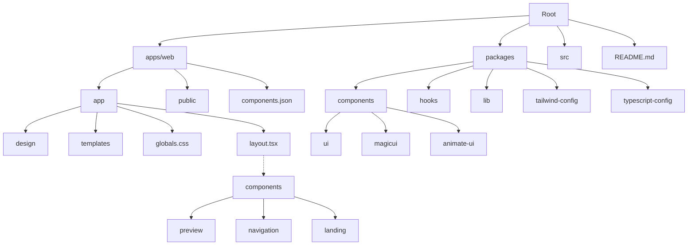
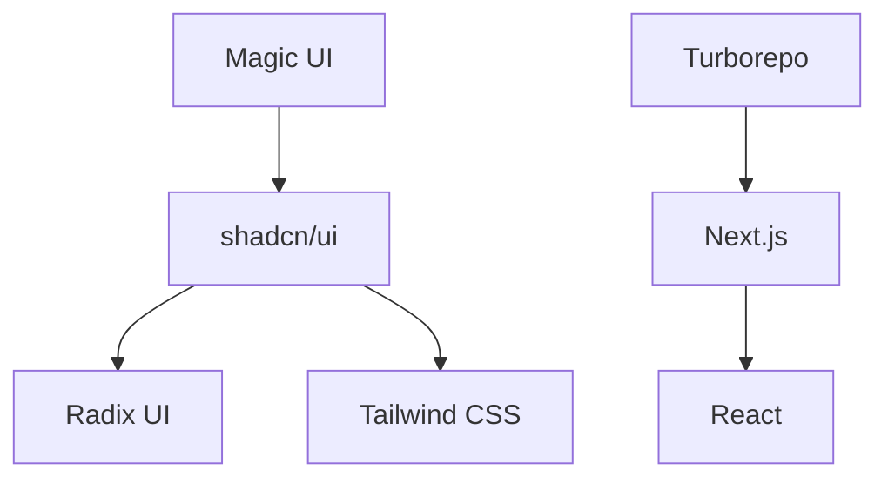

# Web Design Workshop – Project Spec & Developer Map

_A cross-linked, visual, and developer-focused spec for the magic-template Web Design Workshop monorepo._

## Visual Directory Structure



---

## Filetree (with Links)

> Click any file or folder for a summary, relationships, and docs.

```text
- [apps/web/app/design/](#design-section)
- [apps/web/app/templates/](#templates-section)
- [apps/web/src/components/preview/](#preview-system)
- [apps/web/src/components/navigation/](#navigation-system)
- [apps/web/next.config.ts](#nextjs-config)
- [apps/web/globals.css](#globals-css)
- [apps/web/layout.tsx](#app-layout)
- [apps/web/components.json](#components-json)
- [packages/components/src/ui/](#shadcn-ui)
- [packages/components/src/magicui/](#magic-ui)
- [packages/components/src/animate-ui/](#animate-ui)
- [packages/tailwind-config/](#tailwind-css)
- [packages/typescript-config/](#typescript-config)
- [turbo.json](#turborepo)
- [README.md](#project-readme)
```

---

## Dependency Graph



---

## Topics & Summaries
  
### Design Section
  
**Purpose:** Houses all design categories (animations, backgrounds, buttons, etc.) for the component gallery and customization.

**Key Relationships:** Uses [shadcn/ui](#shadcn-ui), [Magic UI](#magic-ui), and [Tailwind CSS](#tailwind-css).

**Docs:** [Next.js Routing](https://nextjs.org/docs/app/building-your-application/routing)

**Summary:**
This section is the heart of the interactive design system, enabling live previews and customization of UI patterns. It is organized by category and supports dynamic routes for extensibility.

---
  
### Templates Section
  
**Purpose:** Contains reusable page and layout templates (e.g., dashboard, login, contact) for rapid prototyping.

**Key Relationships:** Integrates with [preview system](#preview-system) and [design section](#design-section).

**Docs:** [Next.js Pages & Layouts](https://nextjs.org/docs/app/building-your-application/routing/pages-and-layouts)

**Summary:**
Templates provide ready-to-use patterns for common app pages, supporting customization and live preview.

---
  
### Preview System
  
**Purpose:** Provides real-time, responsive previews of components and templates.

**Key Relationships:** Integrates with [design section](#design-section), [shadcn/ui](#shadcn-ui), and [Magic UI](#magic-ui).

**Docs:** TODO

**Summary:**
Enables developers and designers to see and tweak components in context, supporting rapid prototyping and collaboration. Includes grid, controls, and customization panels.

---
  
### Navigation System
  
**Purpose:** Handles all navigation elements, including main nav, breadcrumbs, and mobile navigation.

**Key Relationships:** Uses [shadcn/ui](#shadcn-ui) and [Magic UI](#magic-ui) for UI, and [Next.js](#nextjs-config) for routing.

**Docs:** [Next.js Navigation](https://nextjs.org/docs/app/building-your-application/routing/linking-and-navigating)

**Summary:**
Ensures a unified, accessible navigation experience across devices, with active state tracking and deep linking.

---
  
### Nextjs Config
  
**Purpose:** Project configuration for Next.js, including routing, SSR, and build settings.

**Key Relationships:** Foundation for all app logic; orchestrated by [Turborepo](#turborepo).

**Docs:** [Next.js Config Docs](https://nextjs.org/docs/pages/api-reference/next-config-js)

**Summary:**
Central place for customizing Next.js behavior, SSR, and build optimizations.

---
  
### Globals CSS
  
**Purpose:** Global styles and Tailwind base layer.

**Key Relationships:** Used by all components and pages; powered by [Tailwind CSS](#tailwind-css).

**Docs:** [Tailwind CSS Docs](https://tailwindcss.com/docs/installation)

**Summary:**
Defines the base look and feel for the entire app, ensuring consistency and theming.

---
  
### App Layout
  
**Purpose:** Root application layout for consistent structure and theming.

**Key Relationships:** Wraps all pages and components; uses [shadcn/ui](#shadcn-ui) and [Magic UI](#magic-ui).

**Docs:** [Next.js Layouts](https://nextjs.org/docs/app/building-your-application/routing/pages-and-layouts)

**Summary:**
Defines the main shell of the app, including header, footer, and theming providers.

---
  
### Components JSON
  
**Purpose:** Registry for UI components and resources (shadcn, Magic UI, etc.).

**Key Relationships:** Used by [shadcn/ui](#shadcn-ui) and [Magic UI](#magic-ui) CLIs.

**Docs:** [shadcn/ui Registry](https://ui.shadcn.com/docs/installation)

**Summary:**
Manages component sources and registry dependencies for easy updates and customization.

---
  
### Shadcn UI
  
**Purpose:** Accessible, customizable UI components.

**Key Relationships:** Built on [Radix UI](#radix-ui) and [Tailwind CSS](#tailwind-css).

**Docs:** [shadcn/ui Docs](https://ui.shadcn.com/docs)

**Summary:**
Provides the building blocks for most UI elements in the project. Highly composable and themeable.

---
  
### Magic UI
  
**Purpose:** Design-focused UI library extending shadcn/ui.

**Key Relationships:** Uses [shadcn/ui](#shadcn-ui).

**Docs:** [Magic UI Docs](https://magicui.design/docs)

**Summary:**
Adds advanced animations and design patterns for a modern, interactive experience.

---
  
### Animate UI
  
**Purpose:** Custom animation components and utilities.

**Key Relationships:** Used in [design section](#design-section) and [preview system](#preview-system).

**Docs:** TODO

**Summary:**
Provides reusable animation primitives and effects for UI components.

---
  
### Tailwind CSS
  
**Purpose:** Utility-first CSS framework for rapid UI development.

**Key Relationships:** Used by [shadcn/ui](#shadcn-ui), [Magic UI](#magic-ui), and all app styles.

**Docs:** [Tailwind CSS Docs](https://tailwindcss.com/docs)

**Summary:**
Enables consistent, responsive, and themeable styling across the project.

---
  
### Typescript Config
  
**Purpose:** Shared TypeScript configuration for all packages and apps.

**Key Relationships:** Used by all codebases; orchestrated by [Turborepo](#turborepo).

**Docs:** [TypeScript Config Docs](https://www.typescriptlang.org/tsconfig)

**Summary:**
Ensures type safety and consistency across the monorepo.

---
  
### Turborepo
  
**Purpose:** Monorepo build orchestration.

**Key Relationships:** Orchestrates builds for all packages and apps, including [Next.js](#nextjs-config).

**Docs:** [Turborepo Docs](https://turbo.build/repo/docs)

**Summary:**
Ensures fast, reliable builds and dependency management across the workspace.

---
  
### Project Readme
  
**Purpose:** High-level overview, setup instructions, and contribution guide.

**Key Relationships:** Entry point for new developers; links to all major topics.

**Docs:** TODO

**Summary:**
Start here for onboarding, project goals, and quick links to all documentation.

---
  
### Radix UI
  
**Purpose:** Low-level, accessible UI primitives for React.

**Key Relationships:** Foundation for [shadcn/ui](#shadcn-ui).

**Docs:** [Radix UI Primitives](https://www.radix-ui.com/primitives/docs)

**Summary:**
Provides accessibility and composability for all higher-level UI components.

---
  
### React
  
**Purpose:** Core UI library for building components and managing state.

**Key Relationships:** Used by [Next.js](#nextjs-config), [shadcn/ui](#shadcn-ui), [Magic UI](#magic-ui), and all app logic.

**Docs:** [React Docs](https://react.dev/learn)

**Summary:**
The foundation for all interactive UI in the project.

---

## Relationships & Onboarding Paths

- [Next.js](#nextjs-config) → [React](#react)
- [shadcn/ui](#shadcn-ui) → [Radix UI](#radix-ui), [Tailwind CSS](#tailwind-css)
- [Magic UI](#magic-ui) → [shadcn/ui](#shadcn-ui)
- [Turborepo](#turborepo) → [Next.js](#nextjs-config)

---

## TODOs

- Add missing docs for [Preview System](#preview-system), [Animate UI](#animate-ui), and [Project README](#project-readme).
- Expand topic sections for any new folders or packages.
- Keep all links and summaries up to date as the project evolves.
